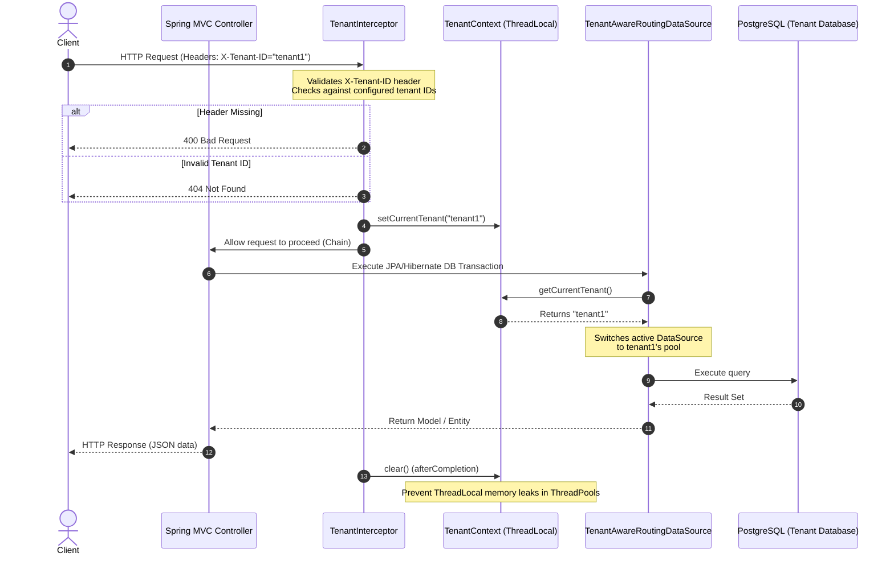
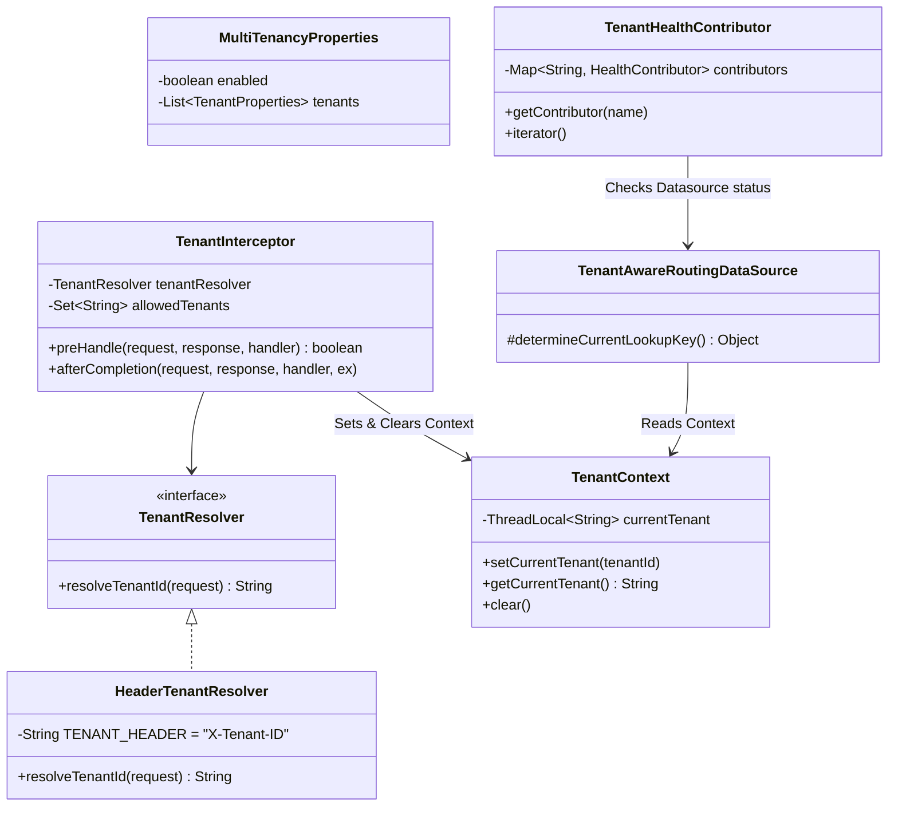

# Multi-Tenant Spring Boot Starter with Data Source Routing

This project provides a robust, production-ready, and highly extensible Spring Boot custom starter library designed for **header-based multi-tenant database routing**. The project enforces clean data isolation across dynamic, tenant-specific database connections and integrates seamlessly with Spring Boot Actuator for health monitoring.

---

## 🏗️ Architectural Design & Implementation

The application solves the problem of data isolation in multi-tenant applications by dynamically selecting the database source at transaction execution time. It operates on a **Database-per-Tenant** isolation model, powered by a customized JDBC datasource router.

### System Sequence Flow

The following diagram illustrates how a client request is intercepted, how the tenant ID context is established securely in a `ThreadLocal` structure, and how it is subsequently routed to the matching PostgreSQL database instance before being cleared out to avoid memory leaks:



### Class Hierarchy and Interactions

The framework revolves around key components from both the `multitenancy-spring-boot-starter` and the `demo-application`:



### Core Architecture Components

1. **`TenantContext`**: Encapsulates a thread-safe static `ThreadLocal<String>` store containing the current request's tenant ID. Crucially, `TenantContext.clear()` is called in the interceptor's `afterCompletion` callback, ensuring thread-local cleanup to prevent memory leaks and data bleeding between concurrent requests sharing pooled thread resources.
2. **`TenantResolver`**: A custom extension hook interface. The default implementation is `HeaderTenantResolver`, which reads from the `X-Tenant-ID` header.
3. **`TenantInterceptor`**: Registered on all `/api/**` URL patterns. It checks for header presence, verifies if the requested tenant exists in the configured registry, and returns `400 Bad Request` or `404 Not Found` if checks fail.
4. **`TenantAwareRoutingDataSource`**: Extends Spring's abstract `AbstractRoutingDataSource`. When a connection is required, it dynamically looks up the key in `TenantContext`.
5. **`TenantHealthContributor`**: Implements Actuator's `CompositeHealthContributor`, dynamically querying all configured databases and exposing their up/down connection statuses in real-time.

---

## 📂 Modules Structure

The repository contains two distinct Maven modules:
* [multitenancy-spring-boot-starter](file:///c:/GPP/Task19%20-%20Spring%20Boot%20Starter/datasourcerouting/multitenancy-spring-boot-starter): The standalone custom Spring Boot starter auto-configuring routing resources, interceptors, and properties.
* [demo-application](file:///c:/GPP/Task19%20-%20Spring%20Boot%20Starter/datasourcerouting/demo-application): A showcase application exposing simple user REST resources to verify database isolation and custom database composite health contributors.

---

## ⚙️ Configuration Properties

The library features auto-configuration driven by properties under the `multitenancy` prefix in your `application.yml` file:

```yaml
multitenancy:
  enabled: true
  tenants:
    - id: tenant1
      url: jdbc:postgresql://db:5432/tenant1_db
      username: user
      password: password
    - id: tenant2
      url: jdbc:postgresql://db:5432/tenant2_db
      username: user
      password: password
    - id: tenant3
      url: jdbc:postgresql://db:5432/tenant3_db
      username: user
      password: password
```

---

## ⚡ API Endpoints Documentation

All user CRUD resources lie under the `/api/**` path pattern and strictly require the `X-Tenant-ID` HTTP header.

### 1. Create User
* **URL**: `/api/users`
* **Method**: `POST`
* **Headers**:
  * `X-Tenant-ID`: `[tenant1 | tenant2 | tenant3]` (Required)
  * `Content-Type`: `application/json`
* **Request Body**:
  ```json
  {
    "name": "Alice Developer",
    "email": "alice@tenant1.com"
  }
  ```
* **Success Response** (Status: `201 Created`):
  ```json
  {
    "id": 1,
    "name": "Alice Developer",
    "email": "alice@tenant1.com"
  }
  ```
* **Validation Error Response** (Status: `400 Bad Request`):
  ```json
  {
    "error": "Bad Request",
    "message": "Name is required"
  }
  ```

---

### 2. Get All Users
* **URL**: `/api/users`
* **Method**: `GET`
* **Headers**:
  * `X-Tenant-ID`: `[tenant1 | tenant2 | tenant3]` (Required)
* **Success Response** (Status: `200 OK`):
  ```json
  [
    {
      "id": 1,
      "name": "Alice Developer",
      "email": "alice@tenant1.com"
    }
  ]
  ```

---

### 3. Get User By ID
* **URL**: `/api/users/{id}`
* **Method**: `GET`
* **Headers**:
  * `X-Tenant-ID`: `[tenant1 | tenant2 | tenant3]` (Required)
* **Success Response** (Status: `200 OK`):
  ```json
  {
    "id": 1,
    "name": "Alice Developer",
    "email": "alice@tenant1.com"
  }
  ```
* **Not Found Response** (Status: `404 Not Found`):
  Empty response body.

---

### 4. Overall Health Check
* **URL**: `/actuator/health`
* **Method**: `GET`
* **Headers**: None (Tenant header not required)
* **Success Response** (Status: `200 OK`):
  ```json
  {
    "status": "UP",
    "components": {
      "db": {
        "status": "UP",
        "details": {
          "database": "PostgreSQL",
          "validationQuery": "isValid()"
        }
      },
      "tenantDbHealthContributor": {
        "status": "UP",
        "components": {
          "tenant1": {
            "status": "UP"
          },
          "tenant2": {
            "status": "UP"
          },
          "tenant3": {
            "status": "UP"
          }
        }
      }
    }
  }
  ```

---

### 5. Tenant Database Health Details Group
* **URL**: `/actuator/health/datasources`
* **Method**: `GET`
* **Headers**: None (Tenant header not required)
* **Success Response** (Status: `200 OK`):
  ```json
  {
    "status": "UP",
    "components": {
      "tenantDbHealthContributor": {
        "status": "UP",
        "components": {
          "tenant1": {
            "status": "UP"
          },
          "tenant2": {
            "status": "UP"
          },
          "tenant3": {
            "status": "UP"
          }
        }
      }
    }
  }
  ```

---

## 🚫 Standard Error Interceptor Responses

Requests sent to the `/api/**` prefix will trigger safety controls if headers are incorrectly formulated.

### Missing Header Rejection
* **Scenario**: The client calls `/api/users` but fails to supply the `X-Tenant-ID` header.
* **HTTP Status**: `400 Bad Request`
* **Response Body**:
  ```json
  {
    "error": "Bad Request",
    "message": "X-Tenant-ID header is missing"
  }
  ```

### Unknown Tenant Rejection
* **Scenario**: The client supplies `X-Tenant-ID: malicious-tenant` or any tenant not matching the active registry list in properties.
* **HTTP Status**: `404 Not Found`
* **Response Body**:
  ```json
  {
    "error": "Not Found",
    "message": "Tenant not found: unknown-tenant"
  }
  ```

---

## 🚀 Getting Started & Testing

### Prerequisites
* Java 21+ JDK
* Maven 3.6+
* Docker & Docker Compose

### 1. Build and Install Starter
From the root workspace folder, install the routing starter library to your local repository cache first:
```bash
mvn clean install
```

### 2. Boot Up the Containers & Application
Build and launch PostgreSQL along with the integrated Demo Application using Docker Compose:
```bash
docker-compose up --build
```
This automatically invokes the `db-init/init-tenant-dbs.sh` setup shell script, spawning and structuring three separated tenant schemas: `tenant1_db`, `tenant2_db`, and `tenant3_db`.

---

## 🧪 Verifying Data Isolation Manually

Use the following `curl` directives to test stateful isolation behavior:

1. **Write data to `tenant1` database:**
   ```bash
   curl -X POST http://localhost:8080/api/users \
     -H "Content-Type: application/json" \
     -H "X-Tenant-ID: tenant1" \
     -d '{"name": "Alice Developer", "email": "alice@tenant1.com"}'
   ```

2. **Write data to `tenant2` database:**
   ```bash
   curl -X POST http://localhost:8080/api/users \
     -H "Content-Type: application/json" \
     -H "X-Tenant-ID: tenant2" \
     -d '{"name": "Bob Admin", "email": "bob@tenant2.com"}'
   ```

3. **Verify distinct data segregation:**
   * Get all `tenant1` users (will show *only* Alice):
     ```bash
     curl -X GET http://localhost:8080/api/users -H "X-Tenant-ID: tenant1"
     ```
   * Get all `tenant2` users (will show *only* Bob):
     ```bash
     curl -X GET http://localhost:8080/api/users -H "X-Tenant-ID: tenant2"
     ```

---

## 📮 Postman Collection Quick Import

For a rapid, graphical, and automated setup, we have bundled a complete Postman Collection:
👉 **[multitenancy_routing.postman_collection.json](file:///c:/GPP/Task19%20-%20Spring%20Boot%20Starter/datasourcerouting/multitenancy_routing.postman_collection.json)**

Simply import this single JSON document directly inside Postman to have all endpoints, success flows, boundary error checks, variables, and assertions set up for immediate testing!
